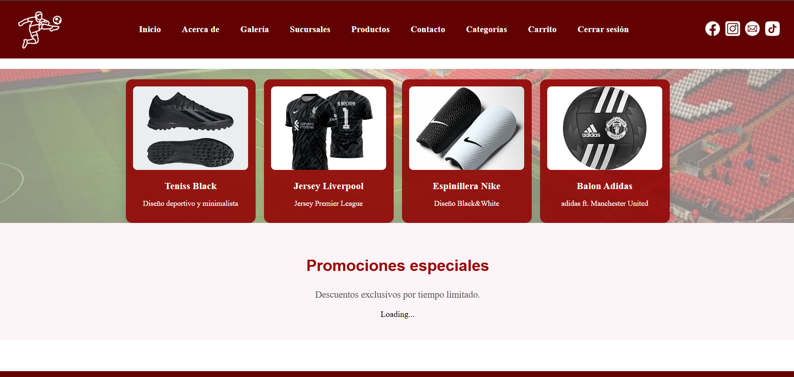
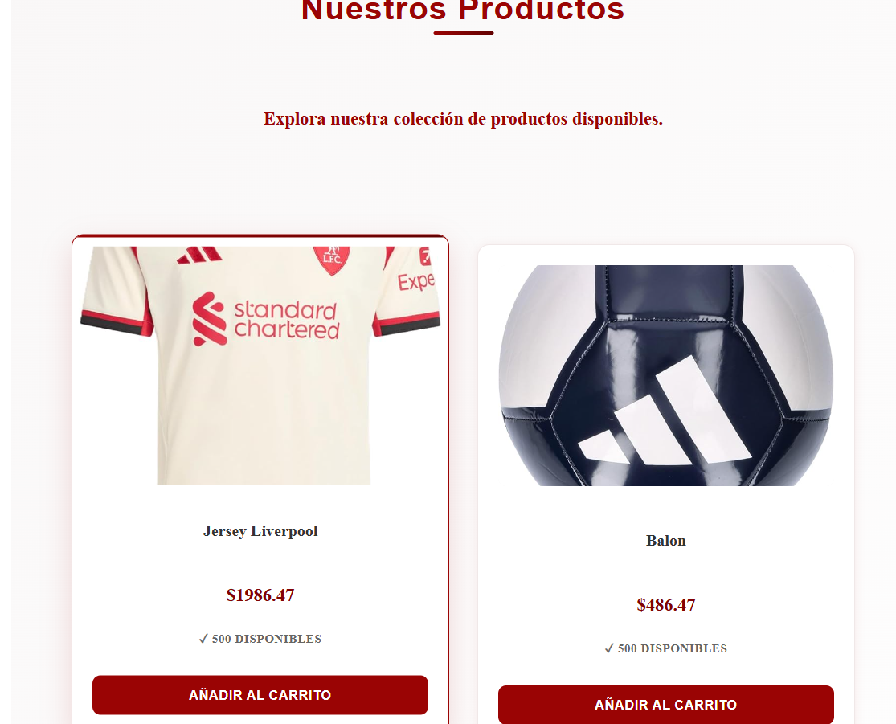
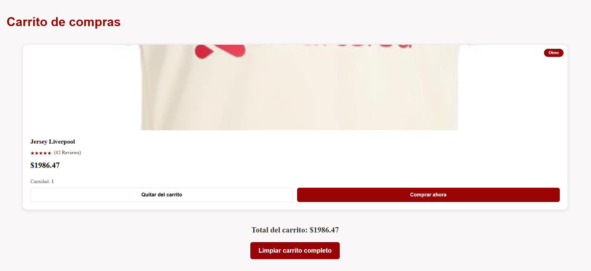
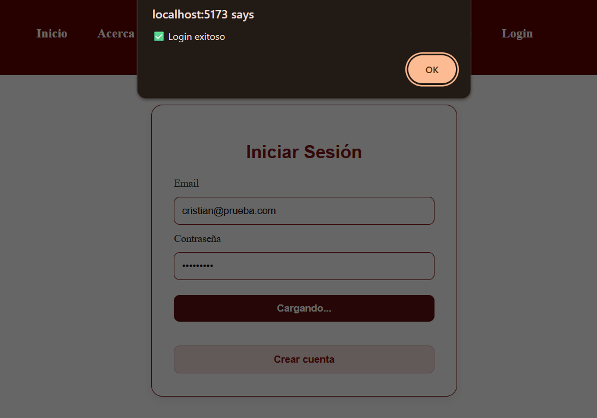
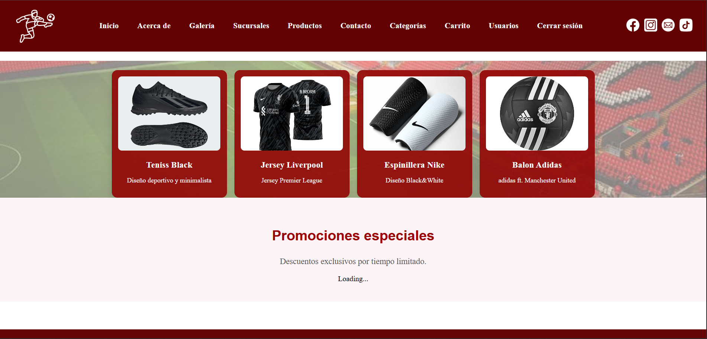
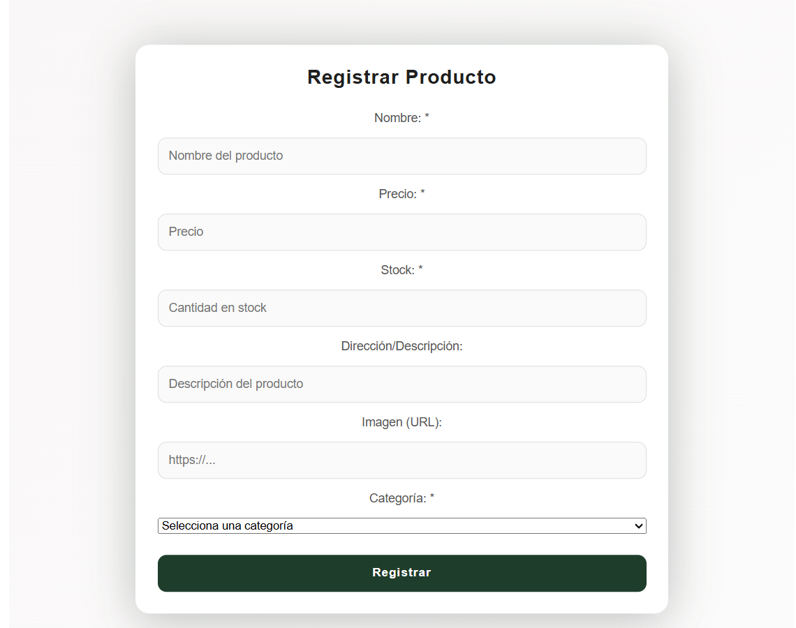
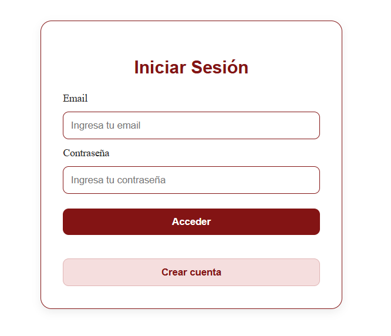
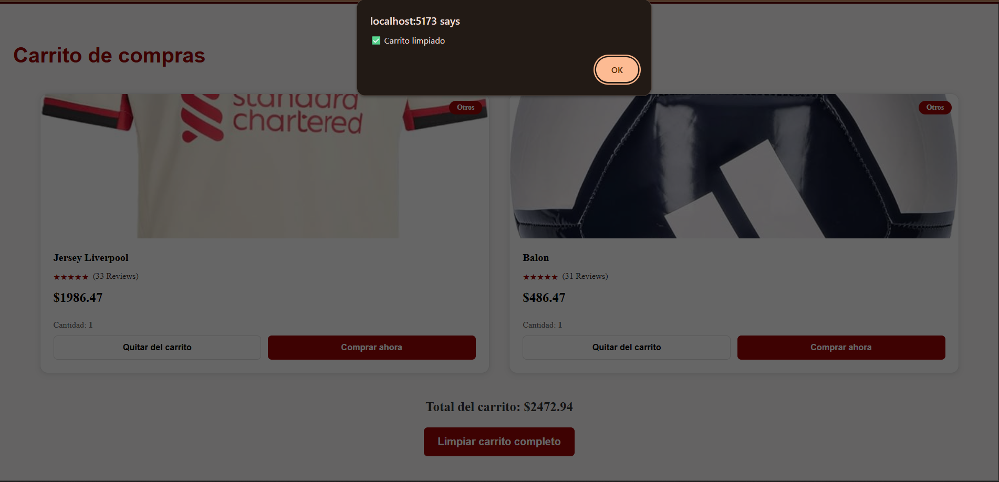
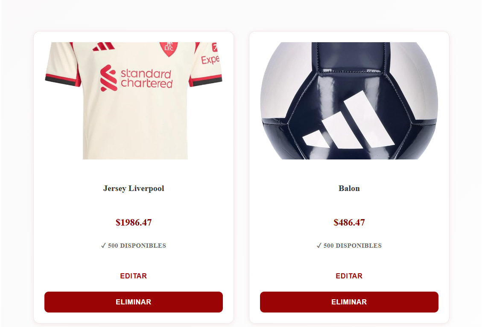
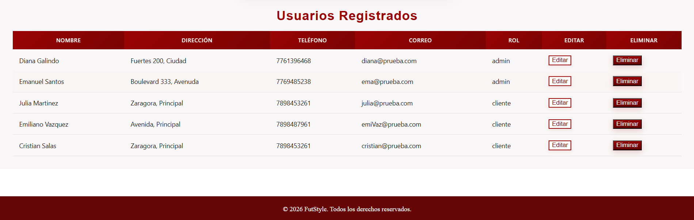

# FutStyle

### *Para quienes el fútbol es parte de su esencia.*

## Descripción

**FutStyle** es una plataforma web de comercio electrónico enfocada en productos relacionados con el fútbol, desarrollada para ofrecer una experiencia moderna, intuitiva y funcional para usuarios apasionados por este deporte.

El sistema permite la gestión de usuarios, autenticación segura, visualización de productos, carrito de compras y administración de inventario mediante un panel exclusivo para administradores, manteniendo conexión con base de datos para la persistencia de información.

---

## Objetivo del proyecto

Desarrollar un sistema web funcional que combine diseño atractivo, experiencia de usuario y gestión dinámica de datos mediante integración entre frontend, backend y base de datos.

---

## Evidencia visual del sistema

### Página principal

  

### Catálogo de productos

  

### Carrito de compras

  

### Inicio de sesión

  

### Panel administrador

  

### Formulario de Crear y Editar producto

  

---

## Funcionalidades implementadas

### Usuario
✅ Panel administrativo

  

✅ Registro de cuenta
✅ Inicio de sesión seguro con JWT

  

✅ Catálogo de productos

  

✅ Carrito de compras
✅ Limpiar carrito de compras

  

### Administrador

✅ Panel administrativo

  

✅ Formulario de Alta y Edición de productos

  

✅ Botones de Edicion y Eliminacion de productos

  

✅ Visualización de registros almacenados en base de datos

  

---

## Tecnologías utilizadas

**Frontend**

* React.js
* JavaScript
* HTML5
* CSS3
* Axios

**Backend**

* Node.js
* Express.js
* Sequelize

**Base de datos**

* MySQL

---

## Filosofía

> *"FutStyle — Para quienes el fútbol es parte de su esencia."*

